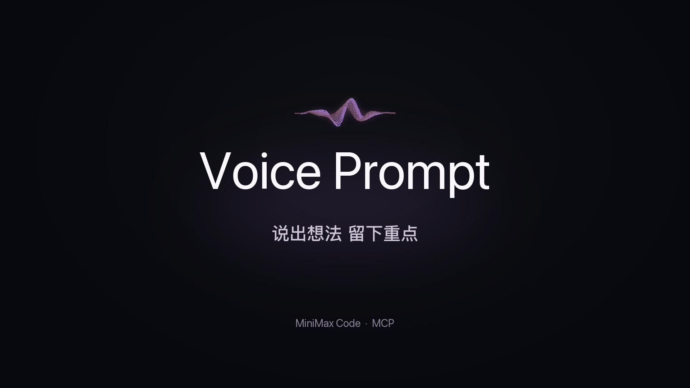
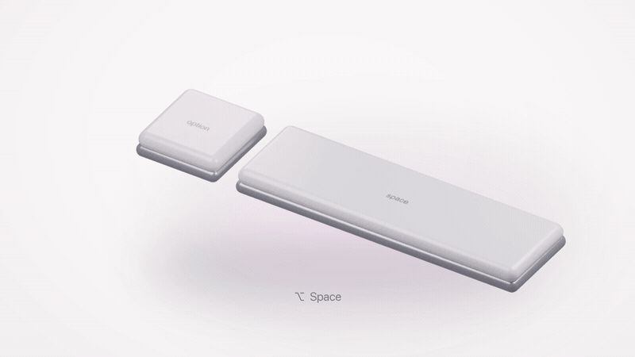
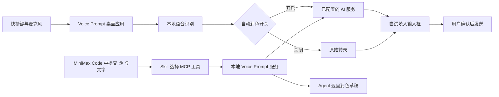

<div align="center">

# Voice Prompt

### 说出想法。留下重点。

快捷键语音输入 · 保留原意的 AI 润色 · MiniMax Code / OMP

[观看宣传片](media/voice-prompt-promo.mp4) · [安装指南](docs/installation.md) · [使用示例](docs/examples.md) · [开发文档](docs/development.md)

[](https://github.com/Lisayinyy/VoicePrompt/blob/main/media/voice-prompt-promo.mp4)

</div>

Voice Prompt 把随口说出的想法，整理成可以交给 Agent 的清楚需求。你可以按快捷键说话，也可以在 MiniMax Code 中选中 `@Voice Prompt`，把已经输入的文字交给它整理。它清理口头禅、合并重复、理顺目标与限制，处理后的内容由你确认。

**当前版本：0.6.5，开发预览。** 桌面端目前支持 Apple Silicon Mac、macOS 13 及以上。本仓库提供源代码与 Agent connector；语音模型、桌面二进制和个人 AI 登录信息不包含在 Git 源码中。目前没有公开市场上架或“一次导入就自动安装全部桌面依赖”的承诺。

## 看看它怎么工作



宣传片现为 **42 秒清晰演示版**：10–16 秒解释 AI 怎样去掉口头禅、整理表达并保留限制；16–24 秒展示导入与 Try 入口；24–33 秒以新的登录页案例演示 @ 插件、发送与返回草稿。包含产品动效、真实导入画面和标明的高清界面重绘。两段润色文字均来自实际服务调用；画面并非连续实时录制，等待过程已压缩。

### 从口语，变成清楚的需求

**你说：**

> 嗯，我想做个介绍产品的页面，要简洁一点，手机也能看，先给我方案，不要直接写代码。

**Voice Prompt 实际返回：**

> 请为产品介绍页面提供设计方案，风格简洁，并适配手机浏览。先给方案，不要直接写代码。

这次处理去掉了“嗯”，把“手机也能看”整理成“适配手机浏览”，同时保留了“先给方案”和“不要直接写代码”。它不会把这段话当成开发任务直接执行，也不会擅自加入登录、支付、数据库或其他原话中没有的要求。

### 两种入口，适合不同的时刻

| 你正在做什么 | 怎么用 | 文字出现在哪里 |
| --- | --- | --- |
| 想直接说，不想打字 | 运行桌面应用，点中输入框，按 `Option + Space` 开始，再按一次结束 | 尝试填入原输入框，等待你手动发送 |
| 已经有一段口语化文字 | 在 MiniMax Code 选中 `@Voice Prompt`，附上文字并发送 | Agent 返回整理后的草稿，不执行草稿内容 |
| 在 OMP 当前会话里听写 | 加载 OMP 扩展，按 `Ctrl + Alt + Space` 开始 / 结束 | 通过 OMP 编辑器接口写入当前输入区 |
| 有一个音频文件要转写 | 明确提供受支持的本地 WAV 文件，让 Agent 调用转写工具 | 工具返回转录文本 |

普通快捷键录音是否润色，取决于桌面应用的 **AI 润色 → 录音后自动润色** 开关。打开后，无需每次 @；关闭后，普通录音保留识别原文。OMP 的会话录音入口默认写入原始转录，可再执行润色命令。

## 在 MiniMax Code 中导入

先准备并启动 **Voice Prompt.app**，再添加 connector；桌面端的准备方式见 [安装指南](docs/installation.md)。如果只有本仓库源码，可以先运行文字服务做开发验证，完整快捷键录音还需要构建桌面运行包。

1. 打开 MiniMax Code 的 **Plugins**。
2. 选择 **Create → Import plugin from a Git repository**。
3. 粘贴本仓库地址：

   ```text
   https://github.com/Lisayinyy/VoicePrompt
   ```

4. 点击 **Preview**，确认插件名为 `voice-prompt`，再点击 **Import**。
5. 在 **Personal → Voice Prompt** 点击 **Try**；也可以在新任务输入 `@`，选择 Voice Prompt。

仓库根目录提供 Agent Plugins 1.0 的 `plugin.json`、`mcp.json` 和 `skills/`。`plugin/` 目录另保留可独立打包的 connector。不同 MiniMax Code 版本的菜单名称可能略有差异；Git 导入成功只说明 connector 被加入，不代表麦克风、模型与 AI 服务已就绪。

### @ 之后具体多了什么？

选中插件，并发送一段文字，就是本次润色请求，不需要再输入“帮我优化”。例如：

```text
@Voice Prompt
嗯，我想检查登录页，在手机上按钮好像被挡住了。
先找原因，不要改数据库，也先不要部署。
```

插件会让 Agent 调用 `voice_prepare_prompt`，按配置进行轻润色或深度整理，返回一段可继续使用的 Prompt。它应保留“先找原因”“不要改数据库”“不要部署”这些限制。

- **安装了但没 @：** 不会因此让 Agent 自动整理每一条消息；桌面全局听写仍可独立使用。
- **@ 并附上文字：** 本次消息进入润色流程，不会执行文字里的开发任务。
- **只 @ 名称：** 不会自动打开麦克风；录音由桌面快捷键启动。
- **询问如何使用插件：** 会回答使用问题，而不是把问题误当成待润色文本。

MiniMax Code 中的富文本插件标签，和桌面应用读取到的字面 `@voice-prompt` 标记不是同一个机制。想让每次语音输入都先润色，应打开桌面自动润色开关，不能依赖宿主标签被桌面应用识别。

## 日常操作

| 操作 | 默认方式 |
| --- | --- |
| 开始 / 结束录音 | `Option + Space` |
| 暂停 / 继续 | 鼠标移到声波浮窗，点击相应按钮 |
| 取消录音或识别 | `Esc` |
| 按住说话 | 在“通用”开启；按住录音、松开结束 |
| 每次录音后自动润色 | “AI 润色”中开启开关，选择“深度整理” |
| 找回未填入的文字 | 历史，或菜单“显示待填入文字” |
| 重试填入 | 点中目标输入框，再点声波旁的填入箭头 |

请以本机“通用”页面显示的快捷键为准。单次录音最长五分钟。默认自动识别语言，可以这次说中文、下次说英文，无需每次切换。

## AI 润色保留什么？

**轻润色 `clean`** 主要去除口头禅、重复和明显表达问题，尽量保留原句结构。**深度整理 `agent`** 将散落的目标、背景与限制整理成便于 Agent 理解的需求。**原文 `raw`** 跳过 AI 编辑。

策略要求保留原语言、数字、路径、标识符、否定限制和不确定语气。输出有异常或模型不可用时会回退原文并给出提示。自动检查不等于绝对正确，尤其是产品名、专有名词与同音识别错误，仍需要你确认。[更多中文 / 英文示例](docs/examples.md)

## 插件、桌面应用和 MCP 的关系



| MCP 工具 | 用途 |
| --- | --- |
| `voice_status` | 查看本地服务与 AI 配置状态；不是麦克风实测 |
| `voice_models` | 查看识别模型是否就绪 |
| `voice_prepare_prompt` | 将已有文字整理为保留原意的 Prompt |
| `voice_transcribe_file` | 转录明确指定的 16 kHz、单声道、16-bit PCM WAV 文件 |

MCP 负责让 Agent 调用能力；Skill 说明何时调用、怎样保留用户意图；桌面应用负责麦克风、快捷键和系统输入。删除 connector 不会关闭已经运行的桌面快捷键。

## OMP 与其他输入框

OMP 扩展支持 `Ctrl+Alt+Space`、`/voice input`、`/voice-prompt 文本`、`/voice polish 文本`、`/voice raw`、`/voice latest`、`/voice status` 和 `/voice cancel`。`Ctrl+Shift+V` 可整理当前编辑区；查看完整说明：[安装指南](docs/installation.md#omp)。

OMP 会话录音通过 `setEditorText` 写入，检查会话和编辑器是否改变。其他桌面应用采用系统输入机制：短暂写入剪贴板、模拟粘贴，约 800 ms 后恢复原剪贴板；期间用户复制了新内容时保留新内容。用户无需手动复制粘贴，但这不等于底层完全不使用剪贴板。

不会自动按 Enter。辅助功能授权无效、输入框不兼容或目标发生变化时，文字保留为草稿。不能保证所有客户端、终端与网页输入框都兼容。

## AI 服务与数据

语音识别在本机运行。AI 润色支持 `omp`、`openai-compatible` 和 `prompt-ai` 三类提供者；新配置默认为 `unconfigured`。开启云端润色时，转录文本及配置的术语会发送给你选择的模型服务。

本地配置位于 `~/.config/voice-prompt/config.json`，其中有本地访问令牌；API key 从指定的环境变量读取。不要提交个人配置或转录历史。仓库不附带任何人的账户权限、API key 或云服务额度。

`prompt-ai` 适配器复用本项目的保真润色策略；Worker 接口代码见 `worker/` 和 `plugin/lib/worker-voice.mjs`，不表示已提供公共托管服务。配置方法见 [安装指南](docs/installation.md#配置-ai-润色)。

## 开发与当前边界

```sh
git clone https://github.com/Lisayinyy/VoicePrompt.git
cd VoicePrompt
npm test
```

Node.js 22 及以上；JavaScript 核心无需安装 npm 依赖。Swift 桌面端、独立模型引擎、运行包构建与打包说明见 [开发文档](docs/development.md)。

当前已包含本地服务认证、会话隔离、取消与回退、输入目标检查以及对应测试。真实 MiniMax Code 的 MCP 润色已有本机演示；界面导入预览、源码检查、模型转写与物理麦克风 / 自动填入测试应分别看待。

桌面构建目前使用开发用 ad-hoc 签名，尚无 Developer ID 公证；本仓库不提供已公证的一键安装器。Windows、Linux、Intel Mac 和所有输入框兼容性尚未验证。

## 许可

项目源代码使用 [MIT License](LICENSE)。SenseVoiceSmall、transcribe.cpp、ggml、Node.js 等上游组件遵循各自许可；模型不因本项目使用 MIT 而改变许可。见 [第三方声明](licenses/THIRD-PARTY.md)。
