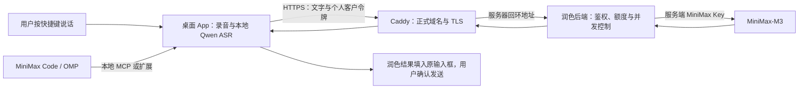

# Voice Prompt 正式域名、HTTPS 与 MCP 上架方案

日期：2026-09-11
状态：设计方案，未执行 DNS 修改、证书申请、服务器续费或上架提交
代码基线：`69a1c57`。已按用户提供的 2026-09-08 MiniMax 飞书投稿指南修订；正式投稿以该指南及配套 App 接入规范为准，社区仓库 PR 流程不作为本次上架路径。详细差距见 [投稿准备清单](minimax-submission-readiness.md)。

## 1. 建议采用的首版架构

沿用腾讯云广州服务器，在现有润色后端前增加 Caddy，提供正式 HTTPS API。MiniMax Code 和 OMP 的快捷键体验仍依赖桌面应用。下图为桌面产品数据流，不表示其身份管理方式已经获得 Marketplace 审核确认；云端鉴权能力先与 MiniMax 评估 App/Connector 接入。



录音与 ASR 留在用户电脑；需要润色时才上传文字。MiniMax Key 仅在服务器保存。每个客户使用独立、可撤销的 Voice Prompt 令牌，不获得发布者的模型 Key 或服务器 SSH 权限。

**正式 HTTPS API 与远程 MCP 是两件事。** 现有 `/voice/prepare` 接收普通 JSON，不实现 MCP 的初始化、工具发现与 JSON-RPC 调用。加域名、证书或者把路径改成 `/mcp` 都不会自动完成协议转换。

| 路线 | 用户得到什么 | 上架影响 | 建议 |
| --- | --- | --- | --- |
| 本地 MCP + 桌面 App + 云端 HTTPS API | 快捷键、本地识别、预览、自动填入、Agent 工具 | 声明桌面依赖与首次配置 | 首版采用 |
| App/Connector + 远程 MCP | Agent 调用云端工具，由平台安全管理连接与用户凭据 | 真正的 HTTPS Streamable HTTP MCP、联调及 provider 确认 | 若走 App 路线，这是投稿前置项 |

仅使用远程 MCP 不能接管用户电脑的麦克风、全局快捷键或输入框。客户端支持的 Streamable HTTP 版本需要实测协商，不能只凭支持 HTTP 就判定兼容。[MCP 传输规范](https://modelcontextprotocol.io/specification/2025-11-25/basic/transports)

## 2. 当前基础与缺口

| 项目 | 当前情况 | 正式发布所需工作 |
| --- | --- | --- |
| 润色后端 | Node + systemd，监听 `127.0.0.1:8787` | 保持回环监听，前置 HTTPS 代理 |
| 开发者连接 | 本机 SSH 隧道，已做真实润色测试 | 改为正式域名；另一台电脑无需 SSH 即可使用 |
| 客户鉴权 | Bearer 令牌哈希表、可停用客户 | 增加领取、撤销、轮换和到期管理 |
| 额度 | 每客户 100 次/日、6 次/分钟；全局 1,000 次/日、10,000 次/月；并发 2 | 用量提示、忙碌提示与公开试用配额说明 |
| 桌面凭据 | 支持当前用户私有文件 `apiKeyFile` | 首次启动写入各用户自己的凭据；后续可接 macOS Keychain |
| 发布包 | 公开包仍为 beta.3；本机 build 23 含新连接逻辑 | 新版签名、公证、打包及干净设备验证 |
| 公开域名、证书、备案 | 尚未在本方案中确认 | 核验域名控制权、主体与备案状态 |
| 共享额度授权 | 技术调用已通 | 对外提供服务前确认套餐使用范围；必要时改用合适的 API 计费方案 |

以上每项不能互相替代：`/healthz` 成功不代表模型返回成功，模型成功不代表文字已实际填入，GitHub CI 成功也不代表插件市场已收录。

## 3. 域名与备案

建议选择一个由产品主体持有的主域名，使用 `api.<正式域名>` 提供润色服务，`www.<正式域名>` 放产品介绍、下载、隐私说明与支持入口。下文 `api.example.com` 均为占位符，不代表已购买或可用域名。

广州属于中国内地节点。正式对外开放前，按腾讯云流程核实服务的备案类别与主体资格；已有其他服务商备案的域名，也需要核实腾讯云接入备案。不能将“只提供 API”当作不必核实备案的依据。[腾讯云接入备案](https://cloud.tencent.com/document/product/243/97669)

需先确认：

1. 域名所有权、DNS 管理权限、是否实名、备案及接入状态
2. 产品以哪个主体运营，域名实名信息与备案主体是否匹配；若主体为香港公司或个人，应由腾讯云确认适用材料和资格
3. 当前一月期轻量服务器是否需要续费以满足备案资源条件

腾讯云当前文档要求：用于备案的中国境内轻量服务器须为包年包月，购买时长累计至少 3 个月（含续费），且备案期间剩余有效期至少 1 个月。域名实名与主体信息也有一致性要求。因此先核实资源资格和续费报价，再提交备案。[备案资源要求](https://cloud.tencent.com/document/product/243/18908/) · [域名与主体限制](https://cloud.tencent.com/document/product/243/18911)

此方案不承诺备案审批时长，也不自动续费或更换地区。

## 4. HTTPS 实施步骤

### DNS 与端口

1. 核实服务器当前公网 IPv4，将 `api` 的 A 记录指向该地址；发布文档不写开发者私有地址或登录信息
2. 灰度切换期间建议 DNS TTL 为 300 秒，稳定后再调整；未配置可用 IPv6 时不添加 AAAA
3. 腾讯云防火墙与 Ubuntu 防火墙统一放行 TCP 80/443；SSH 22 仅向维护者可信来源开放，避免误锁当前管理连接
4. 不公开 8787、本机桌面服务端口或 Caddy 管理端口；首版无需负载均衡、GPU 或 API CDN

Caddy 可自动申请并续期公共证书，默认把 HTTP 引导至 HTTPS。常规 HTTP/TLS 验证需要正确 DNS 和外部可达的端口；证书数据目录必须持久化。客户端从一开始就使用 HTTPS，不把带凭据的请求先发到 HTTP 再依赖跳转。[Caddy HTTPS 配置](https://caddyserver.com/docs/quick-starts/https) · [自动证书管理](https://caddyserver.com/docs/automatic-https)

### Caddy 配置草案

以下仅供评审，尚未在服务器安装或运行。域名确定后用实际安装版本执行 `caddy validate`，再加载；模板检查不等于 DNS、证书或公网连通性验收。

```caddyfile
api.example.com {
    request_body {
        max_size 65536
    }

    @health {
        method GET
        path /healthz
    }
    handle @health {
        reverse_proxy 127.0.0.1:8787
    }

    @polish {
        method POST
        path /voice/prepare
    }
    handle @polish {
        reverse_proxy 127.0.0.1:8787 {
            transport http {
                dial_timeout 3s
                response_header_timeout 40s
            }
        }
    }

    handle {
        respond 404
    }
}
```

代理透传客户 Authorization 供后端校验，不写入统一模型 Key；外部不暴露 `/readyz`。后台就绪状态通过 SSH 检查。请求体限制与现有后端保持 64 KiB；超时顺序还需按上线版本验证，不能对可能已被计费的 POST 请求盲目重试。[反向代理说明](https://caddyserver.com/docs/caddyfile/directives/reverse_proxy) · [请求体限制](https://caddyserver.com/docs/caddyfile/directives/request_body)

采用官方 systemd 服务运行 Caddy，配置变更用 reload，保留证书持久化目录与备份。先不启用请求访问日志或 debug；增加监控时仅记录状态、耗时、请求 ID 与聚合用量，验证错误日志也不会输出凭据或口述正文。TLS 稳定后可单独评估 HSTS，不直接对全部子域名或 preload 做不可逆承诺。[Caddy 服务管理](https://caddyserver.com/docs/running)

## 5. 同事首次使用与客户令牌

目标流程：导入插件 → 按指南安装已签名桌面 App → 系统授权 → App 内兑换邀请 → 下载本地模型 → 按快捷键使用。

**身份方案先确认**：以下邀请流程是桌面产品候选设计，不等于 MiniMax 已接受普通 MCP 包代管用户身份。MiniMax Connector 保存的凭据不回传桌面应用，不能假设 App 能复用这些凭据；需要与平台明确连接方式，或用独立桌面授权。

**需要新增的能力**：邀请兑换与客户令牌发放目前未实现。建议先做小规模邀请内测：一次性随机邀请码设置有效期与可用次数；兑换后发独立客户令牌，服务器保存哈希，支持撤销与轮换。兑换接口需独立限流、防枚举；邀请码与令牌不放 URL、插件 manifest 或日志。桌面 App 保存令牌，插件连接 App，不要求用户填写 MiniMax Key。

上述 Caddy 草案只开放已有接口。邀请兑换接口完成实现和验证后，再将其明确加入允许路由；不预先开放任意路径。产品网站首版只提供介绍和下载，不直接从浏览器调用润色 API；若将来加入网页体验，再单独设计登录与精确的 Origin/CORS 规则。

首次配置明确告知：音频在本机识别；开启润色后，文字发送至 Voice Prompt 后端，再提交 MiniMax。公开隐私说明要包含供应商处理范围，不能把“后端不持久化正文”扩写成“任何供应商都不会保存”。

客户端灰度配置形态如下，真实客户令牌由首次配置流程写入文件：

```json
{
  "provider": "prompt-ai",
  "baseUrl": "https://api.example.com",
  "apiKeyFile": "/用户自己的私有目录/client-token",
  "model": "MiniMax-M3"
}
```

内测沿用当前总量上限，先邀请少量用户。10,000 次/月的全局上限并不等于每位用户每天都能使用满 100 次；对外说明必须同时体现个人与共享额度。额度不足、网络失败或模型异常时，保留原文并明确提示原因；不自动改用其他收费账号。

## 6. MiniMax Code 上架依据（已按指定指南修订）

采用用户指定的 [MiniMax Plugin 开发与上架指南](https://vrfi1sk8a0.feishu.cn/wiki/QlTLwbAGNiACwLkWI85cFxHzn4L) 及 [App 接入规范](https://vrfi1sk8a0.feishu.cn/wiki/HPtLwSJnHi2KMWkgUtfcWnk8nDc)。本次通过飞书提交表单提供 ZIP 或公开 GitHub 来源，由平台生成 Release MR、人工审核并发布；不走此前建议的社区仓库 PR 投稿方式。

包入口改为 `.minimax-plugin/plugin.json`，ZIP 根目录不能再套 `voice-prompt/`。GitHub 来源可指定不可变 commit/tag 和独立 Plugin 子目录。不得声明 `darkIcon` 或 `hooks`，能力路径显式列入 `apps`、`mcpServers`、`skills`，未使用项保留空数组。任何包内容改变都要提升 SemVer。

首次建议选择 CN 与桌面端 MiniMax Code，这是两个独立表单维度，不写入包 manifest。只有真实完成云端能力和目标环境验证后，才扩展到云端 MiniMax Agent 或 US。

普通 MCP 支持本地 stdio 和远程连接，但涉及鉴权或用户身份时，指南要求先联系 MiniMax 评估 App/Connector。MiniMax App 指平台管理的远程 MCP 连接器，不是我们的 macOS 桌面应用。App 路线必须先实现 HTTPS Streamable HTTP MCP 并联调，再使用平台确认的 provider；不能自行创建 provider 或把 `/voice/prepare` 当作 MCP endpoint。

新版指南禁止的是包安装生命周期脚本、平台专属二进制等；普通可移植 Skill/MCP 脚本可通过明确解释器调用。撤回此前把所有安装器或脚本一概归为禁止的说法。仍不承诺插件导入会静默安装应用、下载模型或获得系统权限；桌面分发与首次安装须披露、验证，并让平台确认配套方式。

App/Connector 可支持用户填写 Token 或 OAuth；投稿包不携带真实凭据。Token 模式需提供静态 HTTPS 获取入口和受控 Header 映射；平台验证真实 tools/list 后建立连接。免用户凭据的托管方式能否适用于我们，应先确认服务认证与用户配额归属，不能假定平台自动提供身份或额度。

上架包、现有本机插件和 GitHub 开发源码是不同产物；本机可用或 CI 成功不表示投稿包符合规范。逐项差距、材料草案与验收标准见 [投稿准备清单](minimax-submission-readiness.md)。

## 7. 实施顺序与验收

| 阶段 | 工作 | 完成证据 |
| --- | --- | --- |
| A 接入分类与资格 | MiniMax 评估普通 MCP / App 路线；确认域名、主体、备案、模型额度范围 | 路线、DNS 控制权和资格明确 |
| B HTTPS | 安装 Caddy、开放端口、配置 DNS、证书与反向代理 | 外网证书链可信、域名匹配、错误 Host/路径不进入应用 |
| C 客户接入 | 按平台确认的路线实现身份流程；App 路线补远程 MCP 和联调 | 新用户可鉴权；App 路线有平台确认 provider |
| D 灰度 | 发布测试包并在另一台 Mac、至少内地与香港网络实测 | 录音→识别→润色→填入完整通过，用户自行发送 |
| E 上架 | 制作 MiniMax V1 包，表单提交 ZIP / GitHub 固定来源 | submission_id、Release MR、发布和市场可见性分别确认 |

技术准备可与备案资料整理并行；不把备案等待时间算作已完成部署。单纯 HTTPS 接入预计 0.5–1 个工作日（域名/备案/DNS 条件就绪后），邀请与配置流程预计 2–4 个工作日，跨设备测试与材料预计 1–2 个工作日。这是仅针对桌面 HTTPS 方案的工程估算，不含新增远程 MCP/OAuth 开发、MiniMax Connector 联调、上架审核、备案、公证等时间；接入路线确定后重新排期。

上线前至少验证：

1. 在不关闭 TLS 校验的情况下成功连接；A/AAAA、证书主机名和有效期正确；证书续期机制、持久化目录与到期告警有明确维护方式
2. 公网不暴露后端 8787、管理端口或本机端口；HTTP 不承接带凭据的业务请求
3. 缺失/错误/撤销令牌返回 401；合法客户真实润色 `fallback=false`；超过体积/额度/并发限制时拒绝上游调用
4. 中文与英文样本保留数字、路径、否定与不确定语气；记录原始识别、润色质量及 P50/P95 耗时，不能用两次测试当服务指标
5. 模型超时、断网、额度耗尽保留原文；App 重启仍能认证；系统权限更新后真实填入成功
6. 服务器重启后后端与 Caddy 恢复；用量账本不丢失；代理和应用错误日志无凭据/正文
7. 在没有开发者 SSH、OMP 登录或个人配置的新电脑完成测试；不能只验证发布者电脑

证书续期采用测试环境或受控演练验证，不反复请求生产证书。监控重点为到期时间、401/429/5xx、模型回退率、耗时、剩余额度、磁盘和服务进程。

回退时保留原配置与前一版本：少量受测客户端可恢复各自原有服务，或使用本地转写；关停云端模型调用后提示暂不可润色。开发者 SSH 隧道只用于本人排查，不作为公开客户回退路径。更换模型 Key 或关闭服务前先处理在途请求，不自动重复扣费。

## 8. 开销与发布决策

| 项目 | 预算口径 |
| --- | --- |
| 已有广州服务器 | 上次实际成交 35 元/月；这不是续费保证价，续费以控制台为准 |
| 备案资源期限 | 若仍累计仅购 1 个月，通常需补足至少 3 个月并满足剩余期限；按同单价简单估算另 70 元，实际待报价 |
| 域名 | 按选定后缀、新购和续费价核对；规划可先预留 50–150 元/年，此为预算而非报价 |
| 公共 HTTPS 证书 | 使用 Let's Encrypt 免费证书；Caddy 自动管理，无须为本方案另买商业证书 |
| 模型服务 | 单列，取决于套餐许可、用量与额度；不计入服务器 35 元内 |
| 桌面公证、分发与下载 | 单列；模型约数 GB，不通过当前 2 Mbps API 服务器分发，后续按下载渠道估算 |

免费证书来源：[Let's Encrypt 入门](https://letsencrypt.org/getting-started/)。域名、续费、公证与分发均未在本次计划中购买。

下一步需要确定的三个输入：**正式域名及控制权、运营/备案主体、首批内测人数和模型额度对外服务权限**。这些明确后先落地 HTTPS 与小范围邀请测试，再提交插件材料。无需为了给 API 加 HTTPS 先购买更大的服务器。
